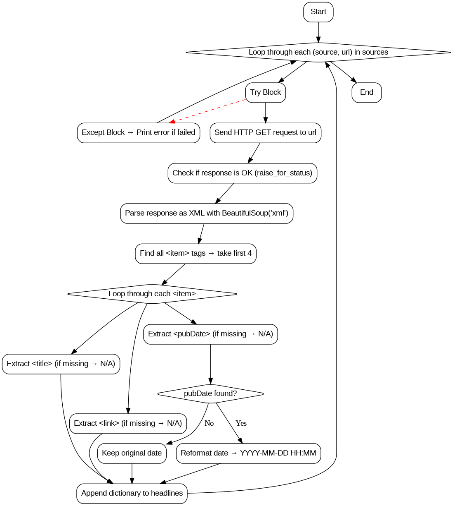

# Label-Nest---News-Headline-Scrapper
News Headline Scrapper - Extract 4 Top Headlines from any two top RSS News feed

## News Headline Scrapper Workflow
For each news source:

Fetch its RSS feed.

Parse it as XML.

Take the first 4 news items.

Extract title, link, and date.

Format the date nicely.

Save everything into a list.

If something goes wrong, print an error but continue.

## News Headline Scrapper - Workflow Diagram

